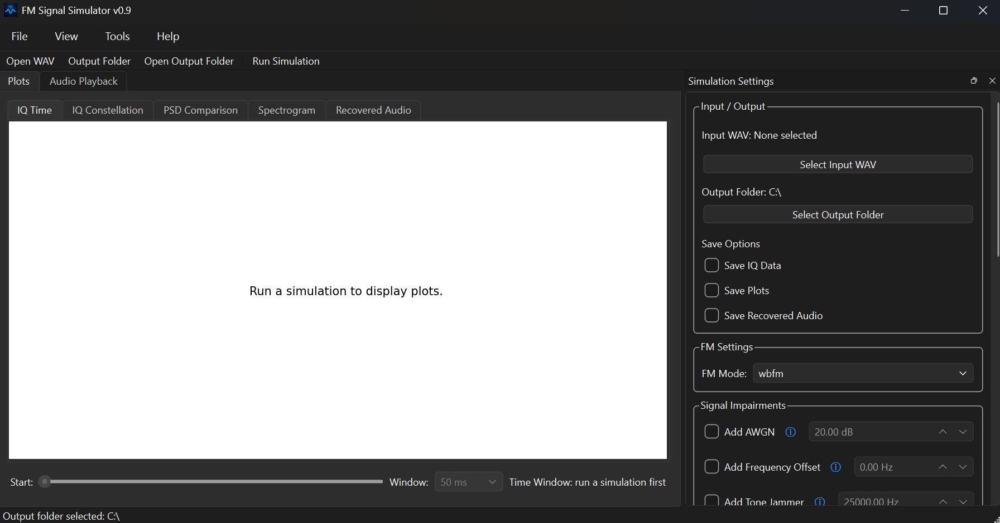
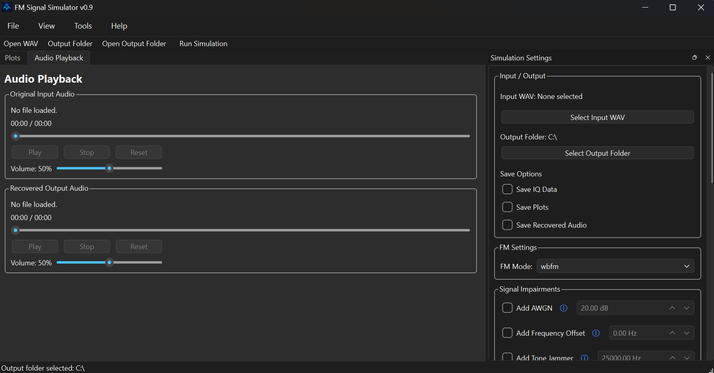
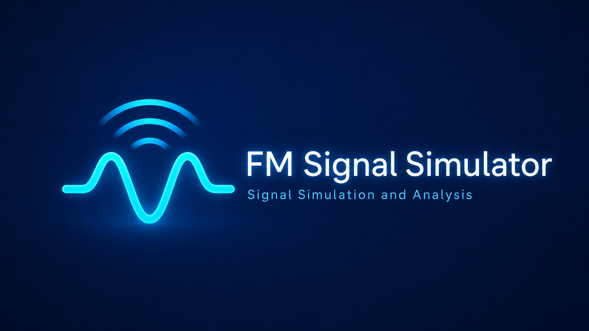

# FM Signal Simulator

A Python-based FM signal simulator that converts `.wav` audio into complex IQ samples with configurable FM modulation and signal impairments.

This project is designed as a learning and research tool for digital signal processing, software-defined radio concepts, RF simulation, and future machine-learning-based signal recovery experiments.

## Current Version

## Current Version

**v0.9**

Version 0.9 prepares FM Signal Simulator for its first Windows executable release.

This release adds application branding, executable packaging support, improved file handling, input validation, simulation-setting validation, and several GUI and audio-playback fixes.

The application now includes a custom program icon and startup splash screen. Version information is centralized so the main window, About dialog, splash screen, Python package metadata, and executable build remain consistent.

The default output directory is now created inside the user's Documents folder:

```text
Documents/FM Signal Simulator/outputs
```

Input WAV files are validated before a simulation begins. The application detects missing, unreadable, unsupported, or empty WAV files and displays a clear error message without crashing.

IQ dropout settings are validated against the duration of the selected audio file. Invalid dropout start times or durations are rejected before the simulation begins.

Recovered-audio playback now uses unique temporary files so repeated simulations update correctly. Previous temporary playback files are removed when replaced, when the application closes, and when the application starts after an interrupted session.

Version 0.9 also adds a PyInstaller build configuration for producing a Windows desktop application with the program icon, splash image, PySide6 GUI, Matplotlib plots, and multimedia playback support.

## Signal Chain

```text
WAV audio
    ↓
GUI or command-line configuration
    ↓
Shared simulation backend
    ↓
Normalized / resampled audio
    ↓
FM IQ modulation
    ↓
Clean IQ copy saved for comparison
    ↓
Signal impairments
    ↓
FM demodulation
    ↓
Optional recovered WAV audio export
    ↓
Optional IQ file export
    ↓
Optional diagnostic plots
    ↓
Optional config JSON export
```

## Features

* Narrowband FM and wideband FM modulation
* Configurable IQ sample rate, FM deviation, and repeatable random seed
* RF impairments including AWGN, frequency offset, tone jammer, IQ dropout, DC offset, and IQ gain/phase imbalance
* FM demodulation with recovered audio playback and optional WAV export
* Optional IQ, plot, configuration, and recovered-audio saving
* Shared simulation backend for CLI and PySide6 GUI use
* Integrated GUI plots for IQ Time, IQ Constellation, PSD Comparison, Spectrogram, and Recovered Audio
* Adjustable time windows and plot appearance settings
* Original and recovered audio playback with play, stop, reset, seek, time, and volume controls
* Background-threaded simulations to keep the GUI responsive
* Dockable settings panel, toolbar, menus, status bar, and impairment help
* Input WAV, output-folder, and dropout-setting validation
* Automatic temporary audio-file cleanup and reliable repeated-run playback
* Default output folder in the user's Documents directory
* Custom application icon and startup splash screen
* Windows executable packaging support with a reusable PyInstaller `.spec` file

## Project Structure

```text
fm-signal-simulator/
  fmsim/
    __init__.py
    audio.py
    cli.py
    demod.py
    fm.py
    impairments.py
    io.py
    playback.py
    plots.py
    resources.py
    simulation.py
    version.py
    gui/
      __init__.py
      appearance_dialog.py
      audio_playback_panel.py
      main_window.py
      plot_panel.py
      settings_panel.py
      widgets.py
      worker.py
    resources/
      icons/
        fmsim.ico
      images/
        splash.png
  examples/
    sample_audio.wav
  outputs/
  FM Signal Simulator.spec
  README.md
  requirements.txt
  pyproject.toml
```

## Installation

### Install from the project metadata

Create and activate a virtual environment:

```bash
python -m venv .venv
.venv\Scripts\activate
```

Install the project:

```bash
py -m pip install -e .
```

This installs:

* NumPy
* SciPy
* Matplotlib
* PySide6

To also install PyInstaller for executable development:

```bash
py -m pip install -e ".[dev]"
```

### Install from requirements.txt

```bash
py -m pip install -r requirements.txt
```

### Launch the GUI

```bash
py -m fmsim.gui.main_window
```

When installed through `pyproject.toml`, the GUI can also be launched with:

```bash
fmsim-gui
```

The command-line interface can be launched with:

```bash
fmsim examples/sample_audio.wav --mode wbfm
```

## Windows Executable

Version 0.9 includes preparation for packaging FM Signal Simulator as a Windows desktop application.

Build the application from the project root with:

```bash
py -m PyInstaller --noconfirm --clean "FM Signal Simulator.spec"
```

The folder-based executable will be created at:

```text
dist/FM Signal Simulator/FM Signal Simulator.exe
```

The packaged application includes:

* FM Signal Simulator executable
* Application icon
* Startup splash screen
* PySide6 GUI components
* Qt multimedia playback support
* Matplotlib plotting support
* NumPy and SciPy simulation dependencies

The entire generated `dist/FM Signal Simulator` folder must be kept together when using the folder-based build.

Generated build folders are excluded from Git:

```text
build/
dist/
```

The PyInstaller `.spec` file is tracked because it defines the repeatable executable build configuration.

## GUI Usage

Launch the desktop graphical user interface from the project root folder:

```bash
py gui.py
```

The GUI provides a desktop engineering-tool style layout with:

* A top menu bar for File, View, Tools, and Help actions
* A toolbar for quick access to common commands
* A right-side Simulation Settings panel
* A central workspace with separate Plots and Audio Playback tabs
* A bottom status bar for run status and progress indication

The GUI allows the user to:

* Select an input `.wav` audio file
* Select an output folder
* Open the selected output folder directly from the GUI
* Choose WBFM or NBFM modulation
* Configure AWGN, frequency offset, tone jammer, IQ dropout, DC offset, and IQ imbalance
* Select a repeatable random seed
* Save recovered audio, IQ samples, diagnostic plots, and simulation configuration data
* View integrated plots directly inside the GUI
* Adjust the visible time window for IQ time-domain and recovered audio plots
* Change the plot background color from the Tools menu
* View basic help and impairment information from the Help menu
* Play the original input audio directly from the GUI
* Play recovered audio after each simulation
* Play recovered audio even when WAV export is disabled
* Seek through original and recovered audio using draggable sliders
* Independently control original and recovered playback volume
* Stop playback at the current position or reset it to the beginning
* View short explanations for each impairment using information buttons

Integrated GUI plot tabs include:
* IQ Time
* IQ Constellation
* PSD Comparison
* Spectrogram
* Recovered Audio

When the application starts, a branded splash screen is shown while the main window is created. The program icon is used in the title bar, Windows taskbar, dialogs, and packaged executable.

By default, simulation files are written to:

```text
Documents/FM Signal Simulator/outputs
```

A different output directory can be selected from the Simulation Settings panel, toolbar, or File menu.

The GUI validates the selected WAV file and output folder before starting a simulation. Invalid or missing files, unreadable audio, empty WAV files, unwritable output folders, and invalid dropout timing produce a warning instead of crashing the application.

The Audio Playback tab contains separate players for the original input WAV and recovered output audio. Each player includes play, stop, reset, seek, elapsed-time, duration, and volume controls. Original playback becomes available after selecting an input WAV, while recovered playback becomes available after a simulation completes.

The Save Recovered Audio option controls permanent WAV export only. Recovered audio remains available for playback when this option is unchecked by using a temporary playback file.

The IQ Time and Recovered Audio plots include a time slider and window length selector so different parts of the signal can be inspected without plotting the entire waveform at once.

Inactive impairment value controls are disabled until their checkbox is selected. Simulation runs are executed in a background thread so the interface remains responsive while the simulation is running.

## Screenshots

### Main Application Window



### IQ Constellation with Tone Jammer


### Audio Playback



### Startup Splash Screen



## Command-Line Usage

Run the simulator from the project root folder:

```bash
py -m fmsim.cli examples/sample_audio.wav --mode wbfm
```

This runs a wideband FM simulation using the sample audio file.

By default, files are only saved when using options such as `--save-iq`, `--save-plots`, `--save-config`, or `--demod-output`.

## Example CLI Commands

### Wideband FM

```bash
py -m fmsim.cli examples/sample_audio.wav --mode wbfm
```

### Narrowband FM

```bash
py -m fmsim.cli examples/sample_audio.wav --mode nbfm
```

### Add Noise

```bash
py -m fmsim.cli examples/sample_audio.wav --mode wbfm --snr-db 20
```

### Seed

```bash
py -m fmsim.cli examples/sample_audio.wav --mode wbfm --snr-db 20 --seed 123
```

Using the same seed with the same settings produces the same AWGN noise sequence.

### Add Frequency Offset

```bash
py -m fmsim.cli examples/sample_audio.wav --mode wbfm --freq-offset 1000
```

### Add Tone Jammer

```bash
py -m fmsim.cli examples/sample_audio.wav --mode wbfm --tone-jammer-hz 25000 --tone-jammer-power-db -10
```

### Add IQ Dropout

```bash
py -m fmsim.cli examples/sample_audio.wav --mode wbfm --dropout-start 2 --dropout-duration 0.25
```

### Add DC Offset

```bash
py -m fmsim.cli examples/sample_audio.wav --mode wbfm --dc-i 0.1 --dc-q 0.05
```

### Add IQ Imbalance

```bash
py -m fmsim.cli examples/sample_audio.wav --mode wbfm --iq-gain-imbalance-db 3 --iq-phase-imbalance-deg 10
```

### Save IQ Data

```bash
py -m fmsim.cli examples/sample_audio.wav --mode wbfm --save-iq --output-dir outputs/save_iq_test
```

This creates:

```text
outputs/save_iq_test/fm_iq_output.npz
```

### Save Diagnostic Plots

```bash
py -m fmsim.cli examples/sample_audio.wav --mode wbfm --snr-db 20 --save-plots --output-dir outputs/plot_test
```

This creates:

```text
outputs/plot_test/iq_time.png
outputs/plot_test/iq_constellation.png
outputs/plot_test/psd.png
outputs/plot_test/psd_comparison.png
outputs/plot_test/spectrogram.png
outputs/plot_test/recovered_audio.png
```

### Show Plots

```bash
py -m fmsim.cli examples/sample_audio.wav --mode wbfm --snr-db 20 --show-plots
```

### Save Configuration

```bash
py -m fmsim.cli examples/sample_audio.wav --mode wbfm --snr-db 20 --save-config --output-dir outputs/config_test
```

This creates:

```text
outputs/config_test/config.json
```

### Save Recovered Audio

```bash
py -m fmsim.cli examples/sample_audio.wav --mode wbfm --snr-db 20 --demod-output --output-dir outputs/demod_test
```

This creates:

```text
outputs/demod_test/recovered.wav
```

Save Recovered audio with a custom filename:

```bash
py -m fmsim.cli examples/sample_audio.wav --mode wbfm --snr-db 20 --demod-output noisy_recovered.wav --output-dir outputs/demod_test
```

This creates:

```text
outputs/demod_test/noisy_recovered.wav
```

### Full Examples

```bash
py -m fmsim.cli examples/sample_audio.wav --mode wbfm --snr-db 20 --seed 123 --freq-offset 1000 --tone-jammer-hz 25000 --tone-jammer-power-db -15 --dropout-start 2 --dropout-duration 0.25 --dc-i 0.05 --dc-q 0.02 --iq-gain-imbalance-db 2 --iq-phase-imbalance-deg 5 --save-iq --save-plots --save-config --demod-output --output-dir outputs/full_test
```

Expected output:

```text
outputs/full_test/
  fm_iq_output.npz
  config.json
  iq_time.png
  iq_constellation.png
  psd.png
  psd_comparison.png
  spectrogram.png
  recovered_audio.png
  recovered.wav
```

## Command-Line Options

| Option | Description |
|---|---|
| `input_wav` | Input WAV audio file |
| `--mode` | FM mode: `wbfm` or `nbfm` |
| `--fs-iq` | IQ sample rate |
| `--deviation` | Custom FM deviation in Hz |
| `--snr-db` | Signal-to-noise ratio in dB |
| `--seed` | Random seed for repeatable AWGN noise generation |
| `--freq-offset` | Frequency offset in Hz |
| `--tone-jammer-hz` | Tone jammer frequency in Hz |
| `--tone-jammer-power-db` | Tone jammer power in dB |
| `--dropout-start` | Dropout start time in seconds |
| `--dropout-duration` | Dropout duration in seconds |
| `--dc-i` | DC offset added to I channel |
| `--dc-q` | DC offset added to Q channel |
| `--iq-gain-imbalance-db` | Q-channel gain imbalance in dB |
| `--iq-phase-imbalance-deg` | IQ phase imbalance in degrees |
| `--demod-output` | Save demodulated recovered audio as a `.wav` file |
| `--output-dir` | Directory for saved output files |
| `--save-iq` | Save IQ data as `.npz` |
| `--save-plots` | Save diagnostic plots |
| `--show-plots` | Display diagnostic plots |
| `--save-config` | Save run configuration as JSON |


## Example Plots

To generate example plots for this README, run:

```bash
py -m fmsim.cli examples/sample_audio.wav --mode wbfm --snr-db 20 --seed 123 --freq-offset 1000 --tone-jammer-hz 25000 --tone-jammer-power-db -10 --dc-i 0.05 --dc-q 0.02 --iq-gain-imbalance-db 2 --iq-phase-imbalance-deg 5 --save-plots --save-config --demod-output --output-dir outputs/readme_demo
```

After running that command, the following files should be created:

```text
outputs/readme_demo/iq_time.png
outputs/readme_demo/iq_constellation.png
outputs/readme_demo/psd.png
outputs/readme_demo/psd_comparison.png
outputs/readme_demo/spectrogram.png
outputs/readme_demo/recovered_audio.png
outputs/readme_demo/recovered.wav
outputs/readme_demo/config.json
```

## Version History

### v0.9

- Updated the project version to `0.9.0`
- Added a custom application icon
- Added a startup splash screen
- Added centralized application name, description, and version constants
- Added packaged-resource path handling for development and executable builds
- Added PyInstaller Windows executable support
- Added a reusable `FM Signal Simulator.spec` build configuration
- Bundled application icons and splash images with packaged builds
- Added a GUI launcher through `pyproject.toml`
- Added optional PyInstaller development dependencies
- Changed the default output location to the user's Documents folder
- Added automatic default output-folder creation
- Added output-folder write-access validation
- Added input WAV existence and extension validation
- Added unreadable and empty WAV-file detection
- Added sample-rate validation
- Added audio-duration tracking
- Added audio-duration-aware IQ dropout limits
- Added validation for invalid dropout start times
- Added validation for invalid dropout durations
- Added clear GUI warning messages for invalid input and settings
- Improved disabling of controls while a simulation is running
- Fixed recovered-audio playback not updating after repeated simulations
- Added unique temporary recovered-audio filenames
- Added cleanup of replaced temporary playback files
- Added cleanup of temporary playback files when the application closes
- Added cleanup of stale temporary playback files at startup
- Improved output-folder and temporary-file handling for packaged builds
- Tested clean WBFM and NBFM simulation runs
- Tested AWGN, tone jammer, IQ dropout, DC offset, frequency offset, and IQ imbalance behavior
- Tested repeated simulations, plotting, saving, and audio playback in the packaged application

### v0.8
- Added a dedicated Audio Playback tab to the GUI
- Added original input WAV playback
- Added recovered output audio playback
- Added independent Play, Stop, and Reset controls
- Changed Stop behavior to pause at the current playback position
- Added draggable playback seek sliders
- Added elapsed-time and total-duration displays
- Added independent volume controls for original and recovered audio
- Added playback-compatible temporary WAV conversion
- Added recovered-audio playback when Save Recovered Audio is unchecked
- Separated recovered-audio playback from permanent WAV export
- Disabled playback controls until the corresponding audio is available
- Cleared previous recovered audio when a new simulation begins
- Added `playback.py` for reusable audio playback logic
- Added `audio_playback_panel.py` for the GUI playback interface
- Limited plot time-window controls to the IQ Time and Recovered Audio tabs
- Added information buttons for each signal impairment
- Changed optional save settings to unchecked by default
- Updated the project version to `0.8.0`

### v0.7
- Added integrated GUI plot viewing inside the main application window
- Added tabbed plot workspace
- Added IQ Time plot tab
- Added IQ Constellation plot tab
- Added clean vs impaired PSD Comparison plot tab
- Added Spectrogram plot tab
- Added Recovered Audio plot tab
- Added scrollable time-window controls for IQ Time and Recovered Audio plots
- Added selectable plot window lengths: 10 ms, 50 ms, 100 ms, 250 ms, 500 ms, and 1 s
- Added Tools menu Plot Appearance dialog
- Added configurable plot background colors
- Added IQ constellation plot saving as `iq_constellation.png`
- Refactored GUI code into smaller modules:
  - `main_window.py`
  - `settings_panel.py`
  - `plot_panel.py`
  - `appearance_dialog.py`
  - `widgets.py`
  - `worker.py`
- Updated GUI to use shared simulation results directly for embedded plotting

### v0.6
- Rebuilt the GUI around a `QMainWindow` application layout
- Added top menu bar with File, View, Tools, and Help menus
- Added toolbar shortcuts for opening WAV files, selecting output folders, opening the output folder, and running simulations
- Added dockable right-side Simulation Settings panel
- Added central Signal Display Workspace placeholder for future v0.7 plot viewing
- Added bottom status bar with running and completed status messages
- Added indeterminate progress bar while simulations are running
- Moved simulation execution into a background thread to prevent the GUI from freezing
- Added Open Output Folder option to the File menu, toolbar, and Simulation Control panel
- Added Help menu popups for usage instructions, impairment descriptions, and program information
- Disabled impairment value controls when their corresponding checkbox is unchecked
- Disabled mouse-wheel value changes for spin boxes and combo boxes
- Improved spacing between impairment groups
- Updated Matplotlib plotting backend for GUI-safe plot saving

### v0.5
- Refactored the simulation pipeline into `simulation.py`
- Maintained CLI functionality through the shared simulation backend
- Added a PySide6 desktop GUI
- Added input WAV file selection
- Added output folder selection
- Added GUI controls for:
  - WBFM / NBFM mode
  - AWGN
  - Frequency offset
  - Tone jammer frequency and power
  - IQ dropout
  - DC offset
  - IQ gain and phase imbalance
  - Random seed
- Added GUI output options for:
  - Saved IQ data
  - Diagnostic plots
  - Recovered audio
  - Configuration metadata
- Added a scrollable GUI layout

### v0.4
- Added `--seed` for repeatable AWGN noise generation
- Added clean IQ preservation before impairments
- Added clean vs impaired IQ PSD comparison plot
- Added recovered audio snippet plot
- Fixed tone jammer power dB terminal output
- Fixed minor spelling and terminal output issues

### v0.3

- Fixed metadata handling bug in `io.py`
- Added `--demod-output`
- Added FM demodulation from IQ samples
- Added recovered audio WAV export
- Added recovered audio output path routing
- Improved terminal run summary

### v0.2

- Added `--output-dir`
- Added `--save-plots`
- Added `--show-plots`
- Added `--save-iq`
- Added `--save-config`
- Added DC offset impairment
- Added IQ gain and phase imbalance impairment
- Improved output organization

### v0.1

- First working FM signal simulation chain
- WAV audio loading
- Audio normalization and resampling
- FM IQ modulation
- Basic signal impairments
- IQ file saving
- Diagnostic plots

## Project Goals

This project is intended to build practical experience with:

- Digital signal processing
- FM modulation
- SDR-style IQ data
- RF signal impairments
- Python-based simulation
- Signal visualization
- Future machine-learning-based signal recovery experiments